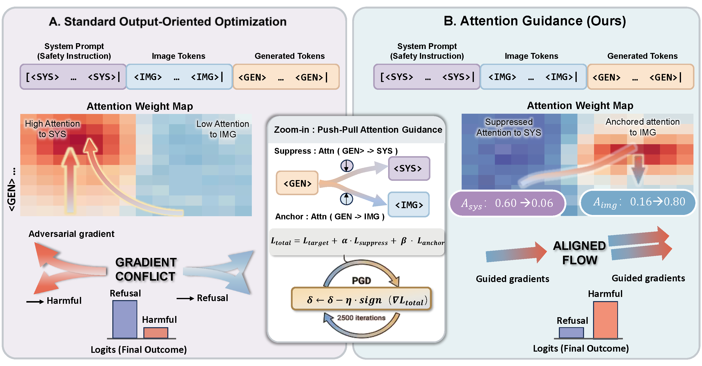

<div align="center">

# 🙈 Seeing No Evil: Blinding Large Vision-Language Models to Safety Instructions via Adversarial Attention Hijacking


[](https://arxiv.org/abs/2604.10299)
[](https://opensource.org/licenses/MIT)
[](https://www.python.org/downloads/release/python-390/)
[](https://pytorch.org/)

**Jingru Li, Wei Ren, Tianqing Zhu**


</div>

<br>

> **TL;DR:** We propose **Attention-Guided Visual Jailbreaking**, revealing a critical vulnerability in Large Vision-Language Models (LVLMs). By directly manipulating attention patterns (Push-Pull Attack), we bypass safety alignments with a **94.4% Attack Success Rate** on Qwen-VL, without overpowering the model's safety constraints.

---

## 💡 Overview

This repository contains the official implementation of **Attention-Guided Visual Jailbreaking**. 

LVLMs continuously retrieve safety instructions through their attention mechanism during text generation. Instead of optimizing image perturbations to maximize harmful output likelihood (which suffers from gradient conflict), our method circumvents this by directly hijacking the attention routing process.

<p align="center">
  
  <br>
  <em>Figure 1: Illustration of our Attention-Guided Visual Jailbreaking framework.</em>
</p>

## 🏆 Key Results

Our method consistently outperforms output-oriented baselines across multiple challenging safety benchmarks.

| Model | AdvBench | HarmBench | JailbreakBench | StrongREJECT |
| :--- | :---: | :---: | :---: | :---: |
| **Qwen-VL-Chat** | **94.4%** | **95.5%** | **90.4%** | **92.0%** |
| **LLaVA-1.5-7B** | 77.5% | 78.0% | 84.0% | 84.0% |
| **InternVL2-8B** | 18.3% | 17.5% | 19.0% | 15.3% |

> *Note: Attack Success Rate (ASR) is evaluated using the Llama Guard 3 safety classifier.*

---

## 🧠 Core Method: Push-Pull Attention Loss

The adversarial optimization is driven by a simple yet highly effective **Push-Pull** dynamic:

1. 🔴 **SUPPRESS (Push):** Reduce attention from generated tokens to system prompt tokens (blinding the model to safety rules).
2. 🟢 **AMPLIFY (Pull):** Increase attention from generated tokens to adversarial image tokens (anchoring the generation).

$$\mathcal{L}_{\text{attn}} = \alpha \cdot \underbrace{\frac{1}{|\mathcal{T}|} \sum_{i \in \mathcal{T}} \sum_{j \in \mathcal{S}} A_{ij}}_{\text{Push: target} \to \text{system}} - \beta \cdot \underbrace{\frac{1}{|\mathcal{T}|} \sum_{i \in \mathcal{T}} \sum_{j \in \mathcal{V}} A_{ij}}_{\text{Pull: target} \to \text{image}}$$

Where $\mathcal{T}$, $\mathcal{S}$, and $\mathcal{V}$ denote the sets of target tokens, system prompt tokens, and image tokens respectively, and $A_{ij}$ is the averaged attention weight over the last $K$ layers.

---

## ⚙️ Installation

**1. Clone the repository**
```bash
git clone [https://github.com/Landsayy/AttentionJailbreak.git](https://github.com/Landsayy/AttentionJailbreak.git)
cd AttentionJailbreak
````

**2. Set up the environment**
We recommend using Conda:

```bash
conda create -n attn_jailbreak python=3.9 -y
conda activate attn_jailbreak
pip install -r requirements.txt
```

**3. Download Model Weights**
| Model Family | HuggingFace Repo ID |
| :--- | :--- |
| **LLaVA** | [`llava-hf/llava-1.5-7b-hf`](https://huggingface.co/llava-hf/llava-1.5-7b-hf) |
| **Qwen-VL** | [`Qwen/Qwen-VL-Chat`](https://huggingface.co/Qwen/Qwen-VL-Chat) |
| **InternVL** | [`OpenGVLab/InternVL2-8B`](https://huggingface.co/OpenGVLab/InternVL2-8B) |
| **Judge** | [`meta-llama/Llama-Guard-3-8B`](https://huggingface.co/meta-llama/Llama-Guard-3-8B) |

-----

## 🚀 Quick Start

### 1\. Generate Adversarial Examples (Attack)

We provide scripts to run the attack across different LVLM architectures. The default perturbation budget is $\epsilon=16/255$.


**For LLaVA-1.5:**

```bash
python attack/attack.py \
    --model llava \
    --model_path /path/to/llava-1.5-7b-hf \
    --image_path images/clean.jpeg \
    --use_corpus \
    --num_iter 2000 \
    --eps 16 \
    --constrained \
    --alpha_suppress 10.0 \
    --beta_amplify 5.0 \
    --save_dir ./results/llava_attack
```

**For Qwen-VL:**

```bash
python attack/attack.py \
    --model qwen \
    --model_path /path/to/qwen-vl-chat \
    --image_path images/clean.jpeg \
    --use_corpus \
    --num_iter 2000 \
    --eps 16 \
    --constrained \
    --alpha_suppress 10.0 \
    --beta_amplify 5.0 \
    --save_dir ./results/qwen_attack
```


### 2\. Generate Target Responses

Evaluate the generated adversarial image against harmful prompts:

```bash
python evaluation/generate_responses.py \
    --model llava \
    --input_file harmful_corpus/input_advbench.json \
    --image_path results/llava_attack/adversarial.png \
    --output_file results/responses/llava_advbench.json \
    --model_path /path/to/llava-1.5-7b-hf
```

### 3\. Evaluate Safety (ASR)

Run the Llama Guard 3 judge to calculate the Attack Success Rate:

```bash
python evaluation/evaluate.py \
    --input_file results/responses/llava_advbench.json \
    --output_csv results/evaluation/llava_advbench_eval.csv \
    --benchmark advbench \
    --condition "PushPull" \
    --model_name "LLaVA-1.5"
```

### ⚡ One-Click Pipeline

To run the end-to-end pipeline (Attack -\> Generate -\> Evaluate):

```bash
bash scripts/run_pipeline.sh \
    --model llava \
    --model_path /path/to/llava-1.5-7b-hf \
    --benchmark advbench \
    --eps 16 \
    --num_iter 2000
```

-----

## 🛠️ Key Hyperparameters

| Parameter | Default | Description |
| :--- | :---: | :--- |
| `--eps` | `16` | Maximum perturbation budget ($L_\infty$ norm, in $1/255$ units) |
| `--num_iter` | `2000` | Number of PGD optimization steps |
| `--alpha_suppress` | `10.0` | Weight ($\alpha$) for pushing attention away from system prompts |
| `--beta_amplify` | `5.0` | Weight ($\beta$) for pulling attention towards the image |
| `--attn_layers` | `last-6` | The specific Transformer layers targeted for attention hijacking |

-----

## 📁 Repository Structure

```text
AttentionJailbreak/
├── attack/
│   └── attack.py              # Core implementation of the Push-Pull adversarial attack
├── evaluation/
│   ├── generate_responses.py  # Script to elicit responses using adversarial images
│   └── evaluate.py            # Safety evaluation wrapper (Llama Guard, Detoxify)
├── harmful_corpus/            # Benchmark datasets and target optimization texts
│   ├── input_advbench.json
│   ├── input_harmbench.json
│   ├── input_jailbreakbench.json
│   ├── input_strongreject.json
│   └── derogatory_corpus.csv  
├── images/                    # Sample clean input images
├── scripts/                   # Bash scripts for automated end-to-end testing
├── requirements.txt
└── README.md
```

-----

## 🤝 Acknowledgements

This work builds upon and extends [Visual Adversarial Examples Jailbreak Large Language Models](https://github.com/Unispac/Visual-Adversarial-Examples-Jailbreak-Large-Language-Models) by [@Unispac](https://github.com/Unispac), which serves as our baseline. We thank the authors for their pioneering work on visual adversarial attacks against VLMs.

-----

## 📜 Citation

If you find our work or this code useful in your research, please consider citing our paper:

```bibtex
@misc{li2026seeingevilblindinglarge,
      title={Seeing No Evil: Blinding Large Vision-Language Models to Safety Instructions via Adversarial Attention Hijacking}, 
      author={Jingru Li and Wei Ren and Tianqing Zhu},
      year={2026},
      eprint={2604.10299},
      archivePrefix={arXiv},
      primaryClass={cs.CV},
      url={[https://arxiv.org/abs/2604.10299](https://arxiv.org/abs/2604.10299)}, 
}
```

-----

## ⚠️ Disclaimer

> This repository contains code for generating adversarial examples that can bypass the safety alignments of Large Vision-Language Models. This project is released for **academic research purposes only** to advance the understanding of VLM vulnerabilities and aid in developing stronger defenses. Any malicious or unethical use of the techniques demonstrated here is strictly prohibited.


